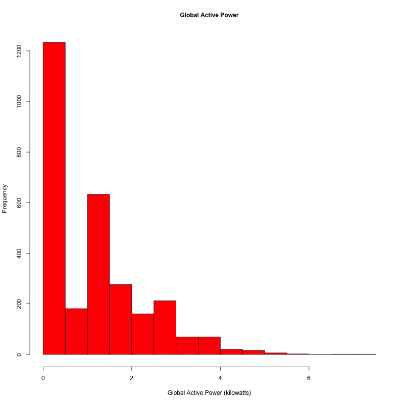
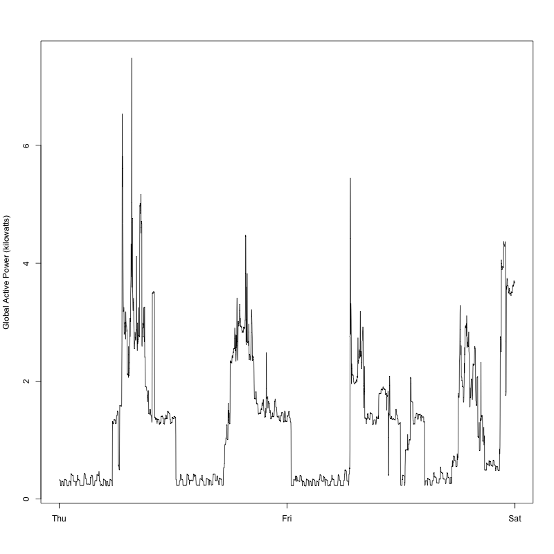
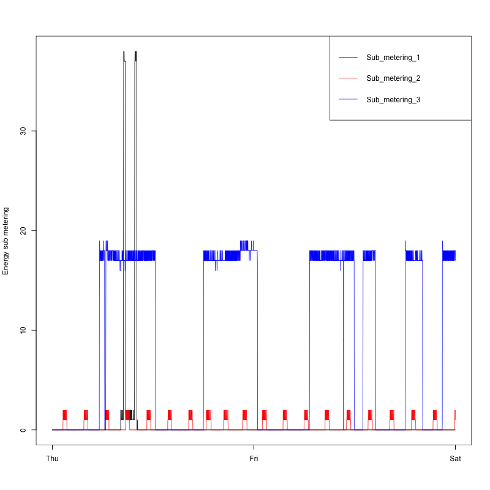
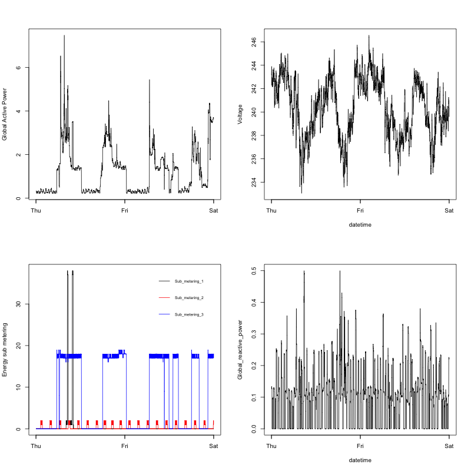

## Introduction

Here are the plots I made for Assignment 1. Code can be found in:

- [load_dataset.R](load_dataset.R)
- [plot1.R](plot1.R)
- [plot2.R](plot2.R)
- [plot3.R](plot3.R)
- [plot4.R](plot4.R)

Note that [load_dataset.R](load_dataset.R) needs to be present along with the plot scripts as it is called by them to load and cache the data set. [load_dataset.R](load_dataset.R) loads data from online so predownload of data is not necessary.

### Plot 1

 

### Plot 2

 

### Plot 3

 

### Plot 4

 